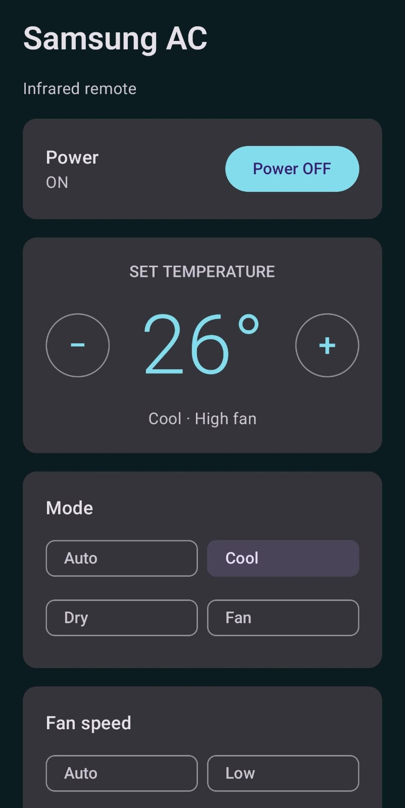
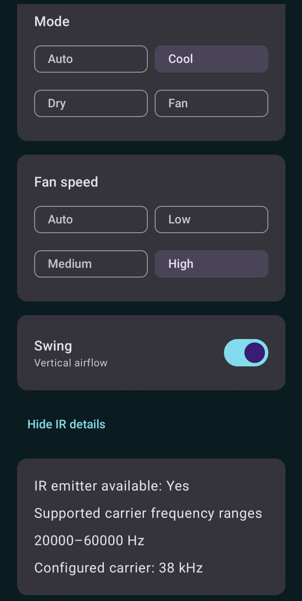

# Samsung AC Remote

I got tired of AC remote apps showing me ads every time I wanted to change something, so I built my own. This is a small, ad-free infrared remote for my Samsung split AC: open it, make an adjustment, and get on with your day.

It uses the phone's built-in IR blaster. No internet connection, ads, login, or account required.

## Preview

<p align="center">
  
  
</p>

## Features

- Power ON/OFF, temperature from 16–30°C, Auto/Cool/Dry/Fan modes, Auto/Low/Medium/High fan speeds, and vertical swing ON/OFF.
- Shows the selected temperature, mode, and fan speed in a simple Compose interface.
- Keeps IR emitter and supported carrier frequency information in an expandable details section.
- Remembers the last state it sent locally. Reopening the app does not send an IR signal.
- Works offline, with no ads or account setup.

## How it works

The app keeps power, temperature, mode, fan speed, and swing in one [`AcState`](app/src/main/java/com/avij/samsungacremote/AcState.kt). [`SamsungAcProtocol`](app/src/main/java/com/avij/samsungacremote/SamsungAcProtocol.kt) encodes that state as a Samsung **AC** IR frame, using extended frames for power changes and standard frames for setting changes. [`IrTransmitter`](app/src/main/java/com/avij/samsungacremote/IrTransmitter.kt) checks for an emitter and a supported 38 kHz carrier before calling Android's `ConsumerIrManager.transmit()`.

The protocol implementation is based on the Samsung AC field mapping, timing, and captured frames in [IRremoteESP8266](https://github.com/crankyoldgit/IRremoteESP8266). It does not use Samsung TV power codes.

## Tech stack

- Kotlin and Jetpack Compose with Material 3
- Android `ConsumerIrManager` for IR transmission
- Android `SharedPreferences` for local state persistence
- Gradle with the included wrapper; minimum Android version: **Android 11 (API 30)**

## Compatibility and requirements

You need an Android phone with a built-in IR emitter that supports **38 kHz**, plus a Samsung AC that understands this Samsung AC protocol variant. The app disables transmission when it cannot confirm the required IR hardware and carrier. An external IR accessory is not supported by the current implementation.

## Build and run

1. Install Android Studio and the Android SDK, then open this repository as a project.
2. Let Gradle sync, connect an IR-equipped Android phone, and run the `app` configuration.
3. Or build a debug APK from the repository root:

   ```bash
   ./gradlew :app:assembleDebug
   ```

   The APK is written to `app/build/outputs/apk/debug/app-debug.apk`.

## A note on state

After the first command, the displayed settings are the **last state the app sent**, not live readings from the AC. A fresh install starts with default settings. Changes made with the original remote are not detected, and restoring the saved state on launch never transmits automatically.

## Project status

This is a personal remote built and tested on a **OnePlus 11R** with an **older Samsung split AC**. It focuses on the everyday controls above; advanced AC features are outside its scope.

## Protocol compatibility

Samsung has used different AC remotes and IR formats across models. Working on the tested setup does **not** mean this app will work with every Samsung AC. Check your AC and remote's protocol before relying on it with another model.
